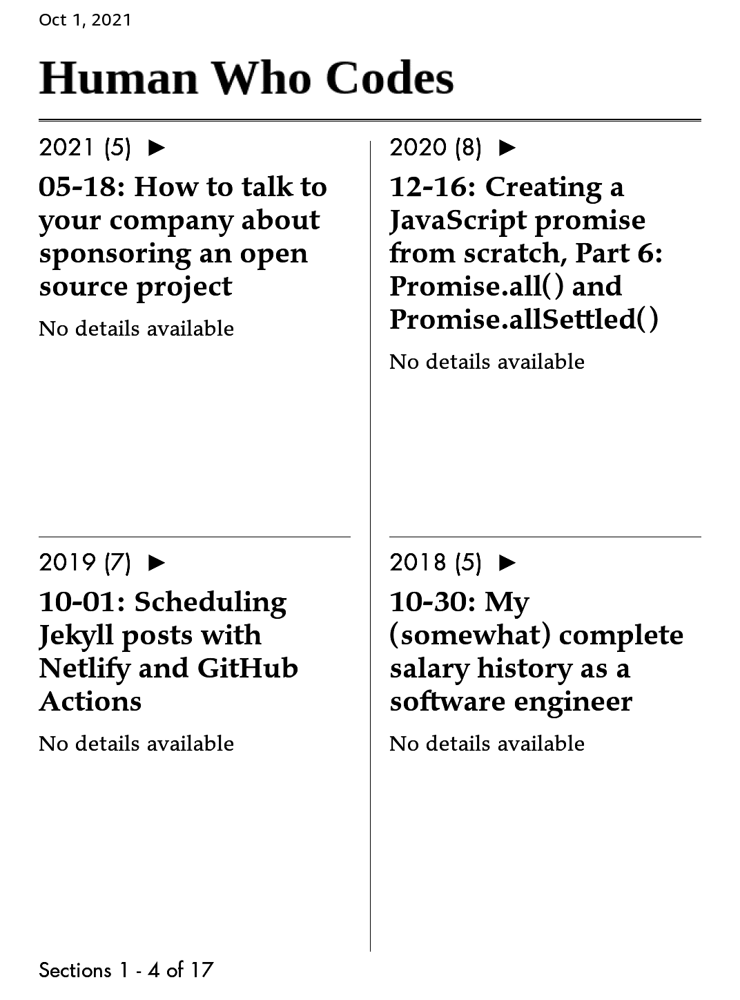

# Use Calibre Recipe to Scrap Local Web Pages

Open a web server in `humanwhocodes.com` folder with `python3 -m http.server 8000`


Run the following command to generate a mobi book for Kindle Paperwhite 3:


```sh
ebook-convert "Human_Who_Codes.recipe" .mobi \
        --authors="Nicholas C. Zakas" \
        --title="Human Who Codes" \
        --pubdate="2021-11-09" \
        --output-profile=kindle_pw3 \
        --mobi-file-type=new \
        -vv
```

## Update 2021-11-09:

 - Designed a cover for this book:
 - Remove navi bar before and after articles:
 - Clean tags manually
 - Reverse yearly blogs order, first publish, first read
 - Enable "Resolve Internal Links"


---




## Resource

 - [Latest Kindle Book](https://t.me/master_thyself/296)
